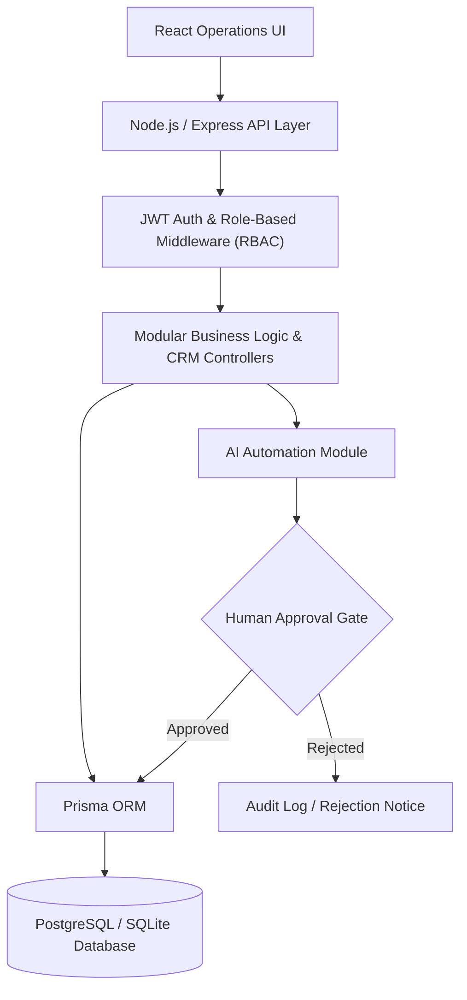

# LexiaCode OS — Architecture Case Study

Sanitized engineering case study for **LexiaCode OS**, an AI-enabled operations platform and modular CRM. This repository outlines the full-stack architecture, API boundaries, security controls, and design decisions implemented to streamline commercial workflows.

---

## 1. Problem & Context

Operations and commercial teams frequently struggle with fragmented tooling across pipeline tracking, client follow-up, and automated messaging. The objective of **LexiaCode OS** was to provide a centralized operating layer that combines automated workflows with strict **role-based access control (RBAC)** and **human-in-the-loop review boundaries** for consequential actions.

---

## 2. Technical Stack

- **Frontend Application:** React 19, TypeScript, Tailwind CSS, Vite.
- **Backend API:** Node.js, Express, RESTful architecture.
- **Data & Persistence Layer:** Prisma ORM with SQLite (development/staging) and PostgreSQL (production-ready).
- **Security & Authorization:** JWT-based authentication, RBAC middleware, strict parameter sanitization, rate-limiting.
- **Testing & Quality:** Vitest, ESLint, automated schema validation.

---

## 3. Architecture at a Glance

---

## 4. Key Engineering Deliverables

1. **Modular Workflow Engine:** Decoupled business modules allowing seamless extension of contact stages, deal pipelines, and automated follow-ups.
2. **Human-in-the-Loop Safeguards:** Any automated notification, high-value status change, or external communication requires an explicit operator confirmation before execution.
3. **Robust Database Modeling:** Relational data schemas designed in Prisma supporting multi-stage lead lifecycles, user permissions, and tamper-evident audit trails.
4. **Security Hardening:** Implementation of CORS restrictions, payload size limits, structured error handlers that prevent stack-trace leaks, and parameterized database queries via Prisma to eliminate SQL injection risks.

---

## 5. Repository Note

*This public repository serves as a sanitized engineering case study. Proprietary client data, internal credentials, and production secrets remain strictly private while presenting verified architectural patterns and delivery evidence.*
