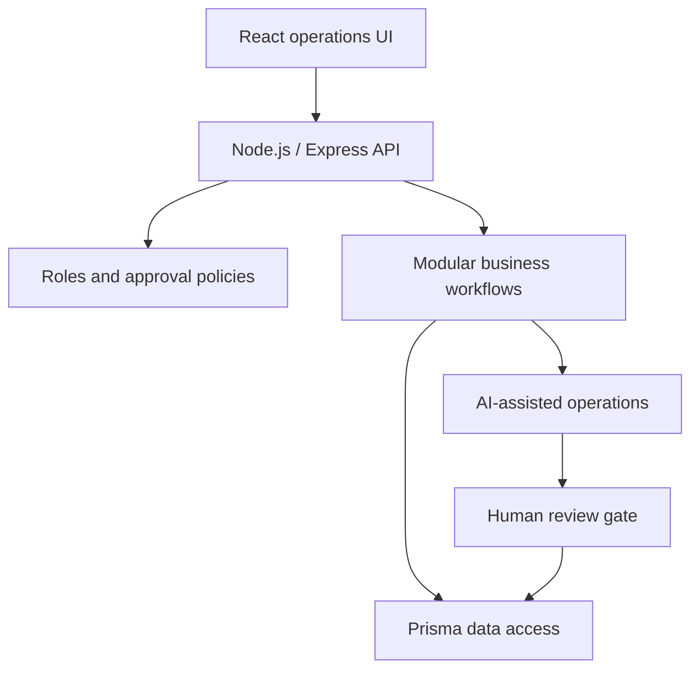

# LexiaCode OS — Architecture Case Study

Sanitized engineering case study for a private AI-enabled CRM and commercial-operations platform. This repository communicates system boundaries, delivery decisions and evidence without publishing client data, credentials or proprietary business logic.

## Product context

Commercial teams need a single operating layer for pipeline management, follow-up, approvals, reporting and AI-assisted routines. The design goal was to reduce fragmented work while preserving human accountability and role-based control.

## Verified scope

- Staged product, QA and security delivery for the private platform.
- Modular CRM and commercial workflows with role-based access controls.
- Human approval gates for consequential AI-assisted actions.
- Security hardening, rate limiting, resilient integrations and regression coverage.
- Public claims limited to scope that is consistent with the final CV and project records.

## Architecture at a glance



The private system remains the source of truth. This diagram exposes architectural intent, not deployable production topology.

## Engineering principles

- **Bounded automation:** AI assists work; policy and human review govern consequential actions.
- **Explicit authorization:** access decisions are enforced at API and workflow boundaries.
- **Modular delivery:** capabilities ship through staged milestones instead of one large release.
- **Failure containment:** integrations use validation, rate controls and defensive error handling.
- **Evidence-based readiness:** regression checks and security work are part of delivery, not post-launch tasks.

## Technology signals

`React` · `Vite` · `Node.js` · `Express` · `Prisma` · `SQLite` · `REST APIs` · `CI/CD Concepts`

## Repository map

```text
.
├── docs/
│   ├── architecture.md
│   ├── evidence.md
│   └── decisions/
│       └── ADR-001-human-approval-boundary.md
├── README.md
└── SECURITY.md
```

## What is intentionally excluded

- Source code from the private platform
- Secrets, credentials and deployment configuration
- Client or user data
- Proprietary prompts, scoring logic and commercial rules
- Claims that cannot be supported by the CV or project records

## Author

[Julio Antonio Villalobo](https://github.com/julitodk06) — AI Transformation & Product Leader
