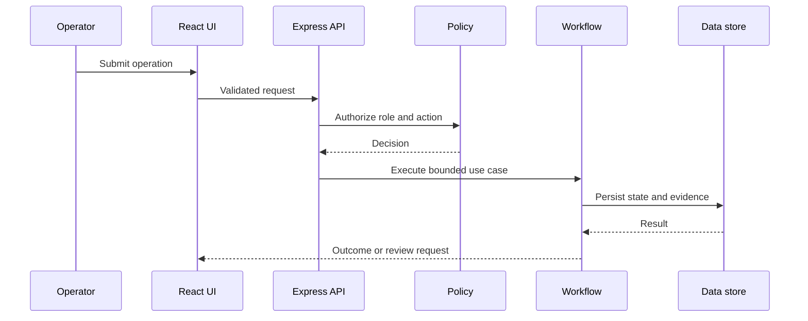

# Architecture Notes

## System shape

LexiaCode OS is represented as a modular web application with four principal boundaries:

1. **Experience layer:** role-aware React interfaces for commercial and operational routines.
2. **Application layer:** Express endpoints coordinate use cases, validation and authorization.
3. **Workflow layer:** modular services implement business routines and AI-assisted steps.
4. **Persistence layer:** Prisma centralizes typed data access and schema evolution.

## Request path

## AI boundary

AI output is treated as untrusted input. A workflow may request an AI-generated recommendation or draft, but the application must validate the response, attach context and require human approval when an action changes material business state.

## Reliability controls

- Schema validation at external and internal boundaries
- Timeout and failure handling for third-party integrations
- Rate limiting on exposed API surfaces
- Regression coverage for critical workflows
- Structured error responses without leaking internal details

## Scaling path

The modular design allows high-volume workloads to move behind queues or independent services if operational evidence justifies the added complexity. Until then, the simpler deployment shape reduces coordination and observability overhead.
