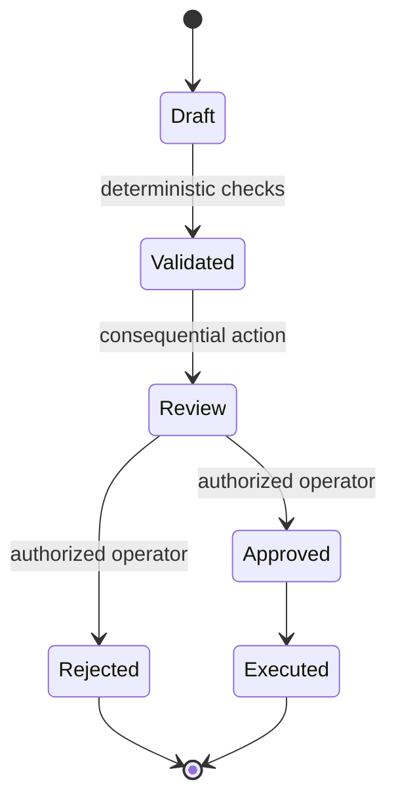

# ADR-001: Preserve Human Approval for Consequential AI Actions

- **Status:** Accepted
- **Context:** AI assistance can accelerate drafting, prioritization and routine operations, but model output is probabilistic and may contain incorrect or unsuitable recommendations.
- **Decision:** AI-generated output remains advisory until validated by deterministic rules and, for consequential actions, approved by an authorized human operator.
- **Consequences:** The system gains accountability and safer failure modes at the cost of additional workflow states and review latency.

## Control pattern

